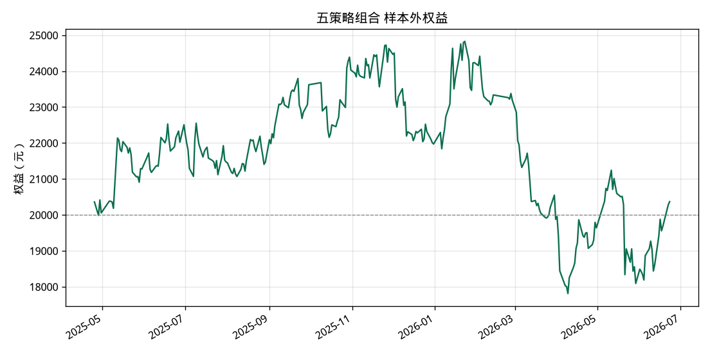

# A股短线回测报告

本报告由本次运行的真实日线计算，不是手填示例。费用、滑点和无法成交的涨跌停都已计入。
历史收益不代表未来收益。

## 假设

- 初始资金 20000 元，最多 4 只持仓，单票预算不超过净值的 35%，且不超过净值的 1/4。
- 佣金万 2.50，单笔最低 5 元；卖出印花税 0.050%（2023-08-28 之前为 0.100%）；过户费 0.0010%。
- 滑点 0.100%，买入更贵、卖出更便宜。
- 主板/创业板/北交所以 100 股为一手；科创板以 200 股为最小买入单位。
- T+1：买入当日不能卖。开盘价达到涨停价的买单作废。最高价仍不超过跌停价的卖单作废并顺延。
- 止损和止盈同一天都碰到时，按先止损计算。
- 样本区间 2024-09-24 至 2026-09-24。信号日价格带 3–50 元，成交额不低于 0.30 亿元，近20日振幅不低于 10%。
- 组合样本外不是五条策略参数的全排列。每一折先为每条策略单独选参，再把这五组参数放在同一个账户里交易。

## 股票池

进入回测的股票共 5325 只。能不能买，按信号当天的价格、成交额、停牌、涨跌停和上市天数判断。

名单过长，报告不逐行展开。覆盖情况写在文末。

## 全样本（默认参数）

| 策略 | 总收益 | 年化收益 | 胜率 | 平均盈利 | 平均亏损 | 最大回撤 | 成交笔数 | 期末权益 |
| --- | ---: | ---: | ---: | ---: | ---: | ---: | ---: | ---: |
| 首板次日承接 | -3.80% | -1.99% | 44.40% | 314.62 | -252.07 | -36.56% | 831 | 19,239.02 |
| 放量突破60日高 | -50.95% | -30.88% | 38.35% | 272.27 | -203.61 | -61.44% | 485 | 9,809.37 |
| 均线回踩 | -15.66% | -8.45% | 40.27% | 251.96 | -180.81 | -42.07% | 442 | 16,867.78 |
| MACD零下金叉 | -32.08% | -18.18% | 40.28% | 255.07 | -196.43 | -47.45% | 432 | 13,583.50 |
| 缩量回调再放量 | -62.20% | -39.61% | 37.72% | 162.89 | -132.97 | -68.47% | 578 | 7,560.25 |
| 五策略组合 | -39.91% | -23.21% | 40.70% | 275.16 | -212.55 | -56.89% | 570 | 12,017.70 |

全样本使用同一套默认参数跑完整段行情，只适合观察策略形态。它会高估实盘，因为参数是看着这段历史定的。

## 走步样本外

每个测试段开始前，只用它之前的训练窗口在小网格里选参数，然后参数冻结，只交易后面的测试段。
训练窗口看不到该测试段的价格。指标用因果复权，后来的分红不会改写更早的信号。
尾部凑不满一个测试窗口的交易日不会进入样本外曲线。

| 策略 | 总收益 | 年化收益 | 胜率 | 平均盈利 | 平均亏损 | 最大回撤 | 成交笔数 | 期末权益 |
| --- | ---: | ---: | ---: | ---: | ---: | ---: | ---: | ---: |
| 首板次日承接（2025-04-25 ~ 2026-06-23） | 7.11% | 6.40% | 41.40% | 336.99 | -232.75 | -18.62% | 471 | 21,421.07 |
| 放量突破60日高（2025-04-25 ~ 2026-06-23） | -17.86% | -16.28% | 42.25% | 349.62 | -272.93 | -39.45% | 329 | 16,427.73 |
| 均线回踩（2025-04-25 ~ 2026-06-23） | 6.52% | 5.87% | 41.70% | 278.70 | -192.20 | -23.70% | 259 | 21,304.80 |
| MACD零下金叉（2025-04-25 ~ 2026-06-23） | -36.87% | -34.00% | 36.33% | 293.45 | -207.14 | -45.88% | 289 | 12,625.31 |
| 缩量回调再放量（2025-04-25 ~ 2026-06-23） | -17.13% | -15.61% | 43.05% | 210.22 | -174.72 | -30.09% | 374 | 16,574.45 |
| 五策略组合（2025-04-25 ~ 2026-06-23） | 1.84% | 1.66% | 45.07% | 295.20 | -240.79 | -28.26% | 355 | 20,367.80 |

### 首板次日承接 的参数选择

| 策略 | 测试区间 | 训练目标值 | 最大持有天数 | 其他关键参数 | 训练期笔数 |
| --- | --- | ---: | ---: | --- | ---: |
| 首板次日承接 | 2025-04-25 ~ 2025-08-06 | 2.280 | 3 | min_ret=-0.01, max_ret=0.06, max_vol_ratio=2.2, take_profit_pct=0.08 | 219 |
| 首板次日承接 | 2025-08-07 ~ 2025-11-20 | 16.242 | 2 | min_ret=-0.01, max_ret=0.06, max_vol_ratio=2.2, take_profit_pct=0.08 | 246 |
| 首板次日承接 | 2025-11-21 ~ 2026-03-10 | 7.537 | 2 | min_ret=-0.01, max_ret=0.06, max_vol_ratio=2.2, take_profit_pct=0.08 | 242 |
| 首板次日承接 | 2026-03-11 ~ 2026-06-23 | 0.900 | 3 | min_ret=-0.01, max_ret=0.06, max_vol_ratio=2.2, take_profit_pct=0.08 | 224 |

### 放量突破60日高 的参数选择

| 策略 | 测试区间 | 训练目标值 | 最大持有天数 | 其他关键参数 | 训练期笔数 |
| --- | --- | ---: | ---: | --- | ---: |
| 放量突破60日高 | 2025-04-25 ~ 2025-08-06 | -0.351 | 5 | min_ret=0.02, max_ret=0.18, vol_ratio=1.3, close_pos=0.65, take_profit_pct=0.1 | 178 |
| 放量突破60日高 | 2025-08-07 ~ 2025-11-20 | 2.740 | 5 | min_ret=0.02, max_ret=0.18, vol_ratio=1.3, close_pos=0.65, take_profit_pct=0.1 | 163 |
| 放量突破60日高 | 2025-11-21 ~ 2026-03-10 | 9.014 | 5 | min_ret=0.02, max_ret=0.18, vol_ratio=1.3, close_pos=0.65, take_profit_pct=0.1 | 155 |
| 放量突破60日高 | 2026-03-11 ~ 2026-06-23 | 0.381 | 5 | min_ret=0.02, max_ret=0.18, vol_ratio=1.8, close_pos=0.65, take_profit_pct=0.1 | 161 |

### 均线回踩 的参数选择

| 策略 | 测试区间 | 训练目标值 | 最大持有天数 | 其他关键参数 | 训练期笔数 |
| --- | --- | ---: | ---: | --- | ---: |
| 均线回踩 | 2025-04-25 ~ 2025-08-06 | -0.464 | 8 | proximity=0.015, max_ret=0.09, take_profit_pct=0.08 | 125 |
| 均线回踩 | 2025-08-07 ~ 2025-11-20 | 1.890 | 5 | proximity=0.015, max_ret=0.09, take_profit_pct=0.08 | 144 |
| 均线回踩 | 2025-11-21 ~ 2026-03-10 | -0.228 | 8 | proximity=0.015, max_ret=0.09, take_profit_pct=0.08 | 122 |
| 均线回踩 | 2026-03-11 ~ 2026-06-23 | -0.153 | 8 | proximity=0.015, max_ret=0.09, take_profit_pct=0.08 | 128 |

### MACD零下金叉 的参数选择

| 策略 | 测试区间 | 训练目标值 | 最大持有天数 | 其他关键参数 | 训练期笔数 |
| --- | --- | ---: | ---: | --- | ---: |
| MACD零下金叉 | 2025-04-25 ~ 2025-08-06 | 0.730 | 10 | below_zero=True, min_vol_ratio=1.0, take_profit_pct=0.08 | 99 |
| MACD零下金叉 | 2025-08-07 ~ 2025-11-20 | 2.775 | 6 | below_zero=False, min_vol_ratio=1.0, take_profit_pct=0.08 | 161 |
| MACD零下金叉 | 2025-11-21 ~ 2026-03-10 | 0.037 | 10 | below_zero=False, min_vol_ratio=1.0, take_profit_pct=0.08 | 148 |
| MACD零下金叉 | 2026-03-11 ~ 2026-06-23 | -1.093 | 10 | below_zero=False, min_vol_ratio=1.0, take_profit_pct=0.08 | 151 |

### 缩量回调再放量 的参数选择

| 策略 | 测试区间 | 训练目标值 | 最大持有天数 | 其他关键参数 | 训练期笔数 |
| --- | --- | ---: | ---: | --- | ---: |
| 缩量回调再放量 | 2025-04-25 ~ 2025-08-06 | -0.740 | 3 | expand=1.3, max_ret=0.09, take_profit_pct=0.06 | 187 |
| 缩量回调再放量 | 2025-08-07 ~ 2025-11-20 | -1.372 | 3 | expand=1.3, max_ret=0.09, take_profit_pct=0.06 | 177 |
| 缩量回调再放量 | 2025-11-21 ~ 2026-03-10 | 5.949 | 3 | expand=1.3, max_ret=0.09, take_profit_pct=0.06 | 190 |
| 缩量回调再放量 | 2026-03-11 ~ 2026-06-23 | 0.099 | 3 | expand=1.8, max_ret=0.09, take_profit_pct=0.06 | 185 |

### 五策略组合 的参数选择

| 策略 | 测试区间 | 训练目标值 | 最大持有天数 | 其他关键参数 | 训练期笔数 |
| --- | --- | ---: | ---: | --- | ---: |
| 首板次日承接 | 2025-04-25 ~ 2025-08-06 | 2.280 | 3 | min_ret=-0.01, max_ret=0.06, max_vol_ratio=2.2, take_profit_pct=0.08 | 219 |
| 首板次日承接 | 2025-08-07 ~ 2025-11-20 | 16.242 | 2 | min_ret=-0.01, max_ret=0.06, max_vol_ratio=2.2, take_profit_pct=0.08 | 246 |
| 首板次日承接 | 2025-11-21 ~ 2026-03-10 | 7.537 | 2 | min_ret=-0.01, max_ret=0.06, max_vol_ratio=2.2, take_profit_pct=0.08 | 242 |
| 首板次日承接 | 2026-03-11 ~ 2026-06-23 | 0.900 | 3 | min_ret=-0.01, max_ret=0.06, max_vol_ratio=2.2, take_profit_pct=0.08 | 224 |
| 放量突破60日高 | 2025-04-25 ~ 2025-08-06 | -0.351 | 5 | min_ret=0.02, max_ret=0.18, vol_ratio=1.3, close_pos=0.65, take_profit_pct=0.1 | 178 |
| 放量突破60日高 | 2025-08-07 ~ 2025-11-20 | 2.740 | 5 | min_ret=0.02, max_ret=0.18, vol_ratio=1.3, close_pos=0.65, take_profit_pct=0.1 | 163 |
| 放量突破60日高 | 2025-11-21 ~ 2026-03-10 | 9.014 | 5 | min_ret=0.02, max_ret=0.18, vol_ratio=1.3, close_pos=0.65, take_profit_pct=0.1 | 155 |
| 放量突破60日高 | 2026-03-11 ~ 2026-06-23 | 0.381 | 5 | min_ret=0.02, max_ret=0.18, vol_ratio=1.8, close_pos=0.65, take_profit_pct=0.1 | 161 |
| 均线回踩 | 2025-04-25 ~ 2025-08-06 | -0.464 | 8 | proximity=0.015, max_ret=0.09, take_profit_pct=0.08 | 125 |
| 均线回踩 | 2025-08-07 ~ 2025-11-20 | 1.890 | 5 | proximity=0.015, max_ret=0.09, take_profit_pct=0.08 | 144 |
| 均线回踩 | 2025-11-21 ~ 2026-03-10 | -0.228 | 8 | proximity=0.015, max_ret=0.09, take_profit_pct=0.08 | 122 |
| 均线回踩 | 2026-03-11 ~ 2026-06-23 | -0.153 | 8 | proximity=0.015, max_ret=0.09, take_profit_pct=0.08 | 128 |
| MACD零下金叉 | 2025-04-25 ~ 2025-08-06 | 0.730 | 10 | below_zero=True, min_vol_ratio=1.0, take_profit_pct=0.08 | 99 |
| MACD零下金叉 | 2025-08-07 ~ 2025-11-20 | 2.775 | 6 | below_zero=False, min_vol_ratio=1.0, take_profit_pct=0.08 | 161 |
| MACD零下金叉 | 2025-11-21 ~ 2026-03-10 | 0.037 | 10 | below_zero=False, min_vol_ratio=1.0, take_profit_pct=0.08 | 148 |
| MACD零下金叉 | 2026-03-11 ~ 2026-06-23 | -1.093 | 10 | below_zero=False, min_vol_ratio=1.0, take_profit_pct=0.08 | 151 |
| 缩量回调再放量 | 2025-04-25 ~ 2025-08-06 | -0.740 | 3 | expand=1.3, max_ret=0.09, take_profit_pct=0.06 | 187 |
| 缩量回调再放量 | 2025-08-07 ~ 2025-11-20 | -1.372 | 3 | expand=1.3, max_ret=0.09, take_profit_pct=0.06 | 177 |
| 缩量回调再放量 | 2025-11-21 ~ 2026-03-10 | 5.949 | 3 | expand=1.3, max_ret=0.09, take_profit_pct=0.06 | 190 |
| 缩量回调再放量 | 2026-03-11 ~ 2026-06-23 | 0.099 | 3 | expand=1.8, max_ret=0.09, take_profit_pct=0.06 | 185 |

## 权益曲线

## 最近成交（全样本组合）

| 代码 | 策略 | 买入日 | 卖出日 | 股数 | 买入价 | 卖出价 | 盈亏 | 原因 |
| --- | --- | --- | --- | ---: | ---: | ---: | ---: | --- |
| 300741 | 放量突破60日高 | 2026-09-08 | 2026-09-11 | 100 | 18.32 | 20.13 | 169.95 | take_profit |
| 300711 | 缩量回调再放量 | 2026-09-09 | 2026-09-11 | 100 | 19.31 | 20.45 | 102.94 | take_profit |
| 603321 | 放量突破60日高 | 2026-09-09 | 2026-09-14 | 300 | 7.60 | 7.13 | -152.11 | stop |
| 000151 | 缩量回调再放量 | 2026-09-14 | 2026-09-15 | 200 | 10.71 | 10.27 | -99.07 | stop |
| 603533 | 缩量回调再放量 | 2026-09-14 | 2026-09-15 | 100 | 24.52 | 23.52 | -111.22 | stop |
| 600798 | 缩量回调再放量 | 2026-09-15 | 2026-09-16 | 700 | 3.61 | 3.45 | -123.26 | stop |
| 600059 | 缩量回调再放量 | 2026-09-16 | 2026-09-17 | 300 | 8.93 | 9.76 | 237.48 | take_profit |
| 002011 | 放量突破60日高 | 2026-09-11 | 2026-09-17 | 200 | 13.14 | 14.44 | 248.50 | take_profit |
| 600488 | 首板次日承接 | 2026-09-16 | 2026-09-21 | 400 | 5.96 | 6.31 | 128.69 | take_profit |
| 300829 | 放量突破60日高 | 2026-09-18 | 2026-09-21 | 100 | 21.18 | 23.28 | 198.80 | take_profit |
| 000561 | 缩量回调再放量 | 2026-09-17 | 2026-09-24 | 300 | 7.76 | 7.67 | -38.19 | time |
| 301193 | 放量突破60日高 | 2026-09-22 | 2026-09-24 | 100 | 22.68 | 24.93 | 213.71 | take_profit |

## 未成交统计（组合）

- 持仓数量已满: 3661
- 低开超出买入区间: 354
- 高开超出买入区间: 150
- 不足一手: 97
- 停牌无法买入: 8
- 涨停无法买入: 2
- 停牌顺延: 1
- 跌停无法卖出: 1

## 对照：上一版 50 只高成交额样本

上一版报告 `reports/backtest_20240924_20260924.md`（提交于全市场重跑之前）用的是新浪成交额靠前、价格大约 3–50 元的 50 只股票。没有退市股票，没有近 20 日振幅过滤，组合也没有单独走步。费用、T+1 和涨跌停规则与现在相同。数字摘自那份报告，不是这次重跑的结果。

全样本（默认参数），2024-09-24 至 2026-09-24：

| 策略 | 总收益 | 年化收益 | 胜率 | 平均盈利 | 平均亏损 | 最大回撤 | 成交笔数 | 期末权益 |
| --- | ---: | ---: | ---: | ---: | ---: | ---: | ---: | ---: |
| 首板次日承接 | -8.78% | -4.65% | 39.77% | 241.36 | -192.51 | -19.50% | 88 | 18,244.64 |
| 放量突破60日高 | -3.54% | -1.85% | 43.48% | 293.60 | -235.61 | -21.56% | 115 | 19,292.97 |
| 均线回踩 | 8.73% | 4.43% | 43.77% | 288.41 | -212.96 | -25.21% | 281 | 21,745.30 |
| MACD零下金叉 | 66.11% | 30.10% | 61.29% | 359.63 | -285.16 | -8.32% | 124 | 33,221.86 |
| 缩量回调再放量 | 21.15% | 10.46% | 52.07% | 275.24 | -226.04 | -11.88% | 121 | 24,230.22 |
| 五策略组合 | 34.68% | 16.69% | 46.72% | 328.97 | -250.95 | -16.28% | 381 | 26,936.22 |

走步样本外（约 2025-04-25 至 2026-06-23）。组合没有走步。

| 策略 | 总收益 | 年化收益 | 胜率 | 平均盈利 | 平均亏损 | 最大回撤 | 成交笔数 | 期末权益 |
| --- | ---: | ---: | ---: | ---: | ---: | ---: | ---: | ---: |
| 首板次日承接 | -2.30% | -2.08% | 38.00% | 285.56 | -189.86 | -13.42% | 50 | 19,539.87 |
| 放量突破60日高 | 15.95% | 14.30% | 55.36% | 324.22 | -274.47 | -7.16% | 56 | 23,189.08 |
| 均线回踩 | -11.23% | -10.21% | 40.10% | 238.11 | -178.45 | -26.83% | 197 | 17,753.03 |
| MACD零下金叉 | 25.08% | 22.40% | 55.88% | 287.83 | -232.25 | -12.78% | 102 | 25,016.37 |
| 缩量回调再放量 | 4.47% | 4.03% | 50.00% | 228.12 | -193.75 | -7.24% | 52 | 20,893.58 |

## 数据与局限

- 新浪 hs_a 当前名单 5568 只（沪深主板、创业板、科创板）。
- 北交所：新浪节点 hs_bjs 返回 347 只，已并入。
- Baostock 股票基础信息：纳入 5559 只（上市 5222，退市 337）。指数和无法识别的代码已丢掉。
- 合并后的目录共 5906 只，已写入缓存。
- 主行情源为腾讯日线（不复权，含除权信息）；单只失败时改用新浪日线。退市代码来自 Baostock 的上市/退市日期，日线仍向腾讯请求。2026-09-27 探测东财 push2his 得到空响应，本次运行没有访问东财。
- 目录 5906 只，其中当前仍上市 5569 只，Baostock 标记已退市 337 只。
- 退市早于回看起点（约 1200 个自然日）而未下载的有 201 只。
- 实际发起日线下载 5705 只，进入回测 5325 只。K线短于策略所需而跳过 25 只。当前风险名称整段跳过 329 只。板块：bj 347、chinext 1431、main 3306、star 621。
- 样本 2024-09-24 至 2026-09-24 内需要覆盖的退市股票 52 只：日线覆盖到样本起点之后的 49 只，有日线但最后一根早于样本起点的 3 只，免费日线没有返回的 0 只。
- 当前名称含 ST、*ST 或退市字样的有 482 只。腾讯和新浪日线没有逐日 ST 字段。Baostock 有逐日 isST，但单只查询实测约 0.8 秒，全市场大约要一小时，这次没有拉取。因此这些股票按当前名称整段排除；已经摘帽、样本期内曾经 ST 的日期没有被去掉。这不是逐日 ST 过滤。
- 停牌日在腾讯日线里通常直接缺 bar，回测按当天没有行情处理，不使用未来的复牌价。
- 次新用上市日期（Baostock 有的话）或首根 K 线晚于样本起点来判断，默认上市不满 120 根日线不买。成交额下限和价格带按信号当日的成交额和收盘价判断。
- 近 20 个交易日最高价到最低价的振幅低于 10% 的股票不进短线信号。这是为了去掉工商银行这类低波动大盘股，不是按行业名称拉黑。
- 另有 26 只免费日线不足 30 根（腾讯和新浪返回的根数一致，是次新而不是网络失败），没有进入回测。例子：301655 仅 26 根，301686 仅 3 根，301688 仅 17 根，301689 仅 11 根，301697 仅 18 根，301699 仅 12 根，601091 仅 6 根，601123 仅 18 根。
- 没有逐笔行情，涨停开板又封死的日内过程用日线近似，真实成交会更差一些。
