# A股短线回测报告

本报告由本次运行的真实日线计算，不是手填示例。费用、滑点和无法成交的涨跌停都已计入。
历史收益不代表未来收益。

## 假设

- 初始资金 20000 元，最多 4 只持仓，单票预算不超过净值的 35%，且不超过净值的 1/4。
- 佣金万 2.50，单笔最低 5 元；卖出印花税 0.050%（2023-08-28 之前为 0.100%）；过户费 0.0010%。
- 滑点 0.100%，买入更贵、卖出更便宜。
- 主板/创业板/北交所以 100 股为一手；科创板以 200 股为最小买入单位。
- T+1：买入当日不能卖。开盘价达到涨停价的买单作废。最高价仍不超过跌停价的卖单作废并顺延。
- 止损和止盈同一天都碰到时，按先止损计算。
- 样本区间 2024-09-24 至 2026-09-24。价格带 3–50 元，信号日成交额不低于 0.30 亿元。

## 股票池

共 50 只，按当时成交额从高到低筛选，价格落在账户能买得起的区间。

| 代码 | 名称 |
| --- | --- |
| 600176 | 中国巨石 |
| 601899 | 紫金矿业 |
| 000725 | 京东方Ａ |
| 002436 | 兴森科技 |
| 600127 | 金健米业 |
| 600522 | 中天科技 |
| 002491 | 通鼎互联 |
| 600664 | 哈药股份 |
| 600418 | 江淮汽车 |
| 002185 | 华天科技 |
| 605358 | 立昂微 |
| 600172 | 黄河旋风 |
| 600105 | 永鼎股份 |
| 002579 | 中京电子 |
| 002119 | 康强电子 |
| 002487 | 大金重工 |
| 000823 | 超声电子 |
| 600869 | 远东股份 |
| 002297 | 博云新材 |
| 000938 | 紫光股份 |
| 600667 | 太极实业 |
| 600699 | 均胜电子 |
| 000560 | 我爱我家 |
| 600186 | 莲花控股 |
| 000592 | 平潭发展 |
| 600900 | 长江电力 |
| 600353 | 旭光电子 |
| 603993 | 洛阳钼业 |
| 000002 | 万 科Ａ |
| 600547 | 山东黄金 |
| 600150 | 中国船舶 |
| 603067 | 振华股份 |
| 301526 | 国际复材 |
| 601872 | 招商轮船 |
| 600206 | 有研新材 |
| 300207 | 欣旺达 |
| 300058 | 蓝色光标 |
| 300179 | 四方达 |
| 002396 | 星网锐捷 |
| 600601 | 方正科技 |
| 600330 | 天通股份 |
| 603601 | 再升科技 |
| 000066 | 中国长城 |
| 601398 | 工商银行 |
| 300059 | 东方财富 |
| 301150 | 中一科技 |
| 601579 | 会稽山 |
| 002241 | 歌尔股份 |
| 600036 | 招商银行 |
| 002741 | 光华科技 |

## 全样本（默认参数）

| 策略 | 总收益 | 年化收益 | 胜率 | 平均盈利 | 平均亏损 | 最大回撤 | 成交笔数 | 期末权益 |
| --- | ---: | ---: | ---: | ---: | ---: | ---: | ---: | ---: |
| 首板次日承接 | -8.78% | -4.65% | 39.77% | 241.36 | -192.51 | -19.50% | 88 | 18,244.64 |
| 放量突破60日高 | -3.54% | -1.85% | 43.48% | 293.60 | -235.61 | -21.56% | 115 | 19,292.97 |
| 均线回踩 | 8.73% | 4.43% | 43.77% | 288.41 | -212.96 | -25.21% | 281 | 21,745.30 |
| MACD零下金叉 | 66.11% | 30.10% | 61.29% | 359.63 | -285.16 | -8.32% | 124 | 33,221.86 |
| 缩量回调再放量 | 21.15% | 10.46% | 52.07% | 275.24 | -226.04 | -11.88% | 121 | 24,230.22 |
| 五策略组合 | 34.68% | 16.69% | 46.72% | 328.97 | -250.95 | -16.28% | 381 | 26,936.22 |

全样本使用同一套默认参数跑完整段行情，只适合观察策略形态。它会高估实盘，因为参数是看着这段历史定的。

## 走步样本外

每个测试段开始前，只用它之前的训练窗口在小网格里选参数，然后参数冻结，只交易后面的测试段。
训练窗口看不到该测试段的价格。指标用因果复权，后来的分红不会改写更早的信号。
尾部凑不满一个测试窗口的交易日不会进入样本外曲线。

| 策略 | 总收益 | 年化收益 | 胜率 | 平均盈利 | 平均亏损 | 最大回撤 | 成交笔数 | 期末权益 |
| --- | ---: | ---: | ---: | ---: | ---: | ---: | ---: | ---: |
| 首板次日承接（2025-04-25 ~ 2026-06-23） | -2.30% | -2.08% | 38.00% | 285.56 | -189.86 | -13.42% | 50 | 19,539.87 |
| 放量突破60日高（2025-04-25 ~ 2026-06-23） | 15.95% | 14.30% | 55.36% | 324.22 | -274.47 | -7.16% | 56 | 23,189.08 |
| 均线回踩（2025-04-25 ~ 2026-06-23） | -11.23% | -10.21% | 40.10% | 238.11 | -178.45 | -26.83% | 197 | 17,753.03 |
| MACD零下金叉（2025-04-25 ~ 2026-06-23） | 25.08% | 22.40% | 55.88% | 287.83 | -232.25 | -12.78% | 102 | 25,016.37 |
| 缩量回调再放量（2025-04-25 ~ 2026-06-23） | 4.47% | 4.03% | 50.00% | 228.12 | -193.75 | -7.24% | 52 | 20,893.58 |

### 首板次日承接 的参数选择

| 测试区间 | 训练目标值 | 最大持有天数 | 其他关键参数 | 训练期笔数 |
| --- | ---: | ---: | --- | ---: |
| 2025-04-25 ~ 2025-08-06 | -1.398 | 3 | min_ret=-0.01, max_ret=0.06, max_vol_ratio=2.2, take_profit_pct=0.05 | 22 |
| 2025-08-07 ~ 2025-11-20 | -1.146 | 3 | min_ret=-0.01, max_ret=0.06, max_vol_ratio=2.2, take_profit_pct=0.08 | 23 |
| 2025-11-21 ~ 2026-03-10 | -1.376 | 2 | min_ret=-0.01, max_ret=0.06, max_vol_ratio=2.2, take_profit_pct=0.08 | 17 |
| 2026-03-11 ~ 2026-06-23 | -1.276 | 3 | min_ret=-0.01, max_ret=0.06, max_vol_ratio=2.2, take_profit_pct=0.08 | 23 |

### 放量突破60日高 的参数选择

| 测试区间 | 训练目标值 | 最大持有天数 | 其他关键参数 | 训练期笔数 |
| --- | ---: | ---: | --- | ---: |
| 2025-04-25 ~ 2025-08-06 | -1.371 | 5 | min_ret=0.02, max_ret=0.18, vol_ratio=1.8, close_pos=0.65, take_profit_pct=0.1 | 23 |
| 2025-08-07 ~ 2025-11-20 | 4.755 | 5 | min_ret=0.02, max_ret=0.18, vol_ratio=1.8, close_pos=0.65, take_profit_pct=0.1 | 26 |
| 2025-11-21 ~ 2026-03-10 | 9.391 | 5 | min_ret=0.02, max_ret=0.18, vol_ratio=1.8, close_pos=0.65, take_profit_pct=0.1 | 38 |
| 2026-03-11 ~ 2026-06-23 | 1.461 | 5 | min_ret=0.02, max_ret=0.18, vol_ratio=1.8, close_pos=0.65, take_profit_pct=0.1 | 31 |

### 均线回踩 的参数选择

| 测试区间 | 训练目标值 | 最大持有天数 | 其他关键参数 | 训练期笔数 |
| --- | ---: | ---: | --- | ---: |
| 2025-04-25 ~ 2025-08-06 | 1.247 | 8 | proximity=0.015, max_ret=0.09, take_profit_pct=0.08 | 78 |
| 2025-08-07 ~ 2025-11-20 | 0.416 | 5 | proximity=0.015, max_ret=0.09, take_profit_pct=0.08 | 84 |
| 2025-11-21 ~ 2026-03-10 | 1.201 | 5 | proximity=0.015, max_ret=0.09, take_profit_pct=0.08 | 105 |
| 2026-03-11 ~ 2026-06-23 | 0.038 | 8 | proximity=0.03, max_ret=0.09, take_profit_pct=0.08 | 101 |

### MACD零下金叉 的参数选择

| 测试区间 | 训练目标值 | 最大持有天数 | 其他关键参数 | 训练期笔数 |
| --- | ---: | ---: | --- | ---: |
| 2025-04-25 ~ 2025-08-06 | 9.979 | 10 | below_zero=True, min_vol_ratio=1.0, take_profit_pct=0.08 | 30 |
| 2025-08-07 ~ 2025-11-20 | 21.020 | 10 | below_zero=True, min_vol_ratio=1.0, take_profit_pct=0.08 | 35 |
| 2025-11-21 ~ 2026-03-10 | 5.284 | 6 | below_zero=False, min_vol_ratio=1.0, take_profit_pct=0.08 | 80 |
| 2026-03-11 ~ 2026-06-23 | 5.746 | 6 | below_zero=False, min_vol_ratio=1.0, take_profit_pct=0.08 | 80 |

### 缩量回调再放量 的参数选择

| 测试区间 | 训练目标值 | 最大持有天数 | 其他关键参数 | 训练期笔数 |
| --- | ---: | ---: | --- | ---: |
| 2025-04-25 ~ 2025-08-06 | 7.942 | 5 | expand=1.8, max_ret=0.09, take_profit_pct=0.06 | 16 |
| 2025-08-07 ~ 2025-11-20 | 8.429 | 5 | expand=1.8, max_ret=0.09, take_profit_pct=0.06 | 16 |
| 2025-11-21 ~ 2026-03-10 | 6.735 | 5 | expand=1.8, max_ret=0.09, take_profit_pct=0.06 | 19 |
| 2026-03-11 ~ 2026-06-23 | 0.024 | 5 | expand=1.3, max_ret=0.09, take_profit_pct=0.06 | 46 |

## 权益曲线

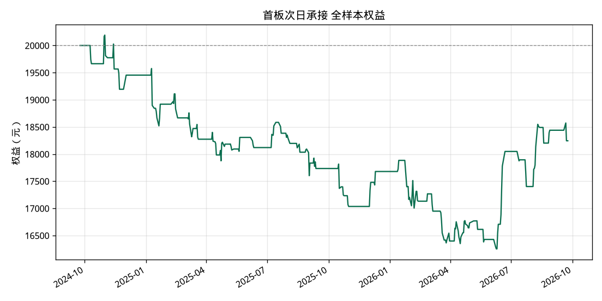

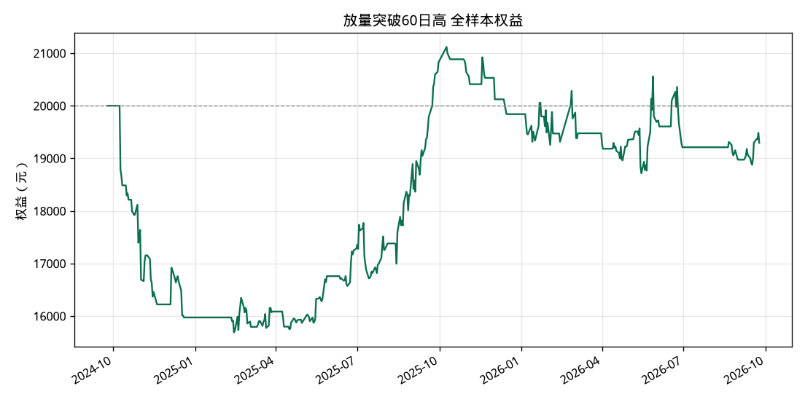

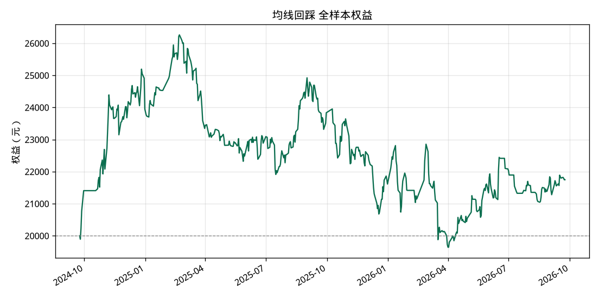

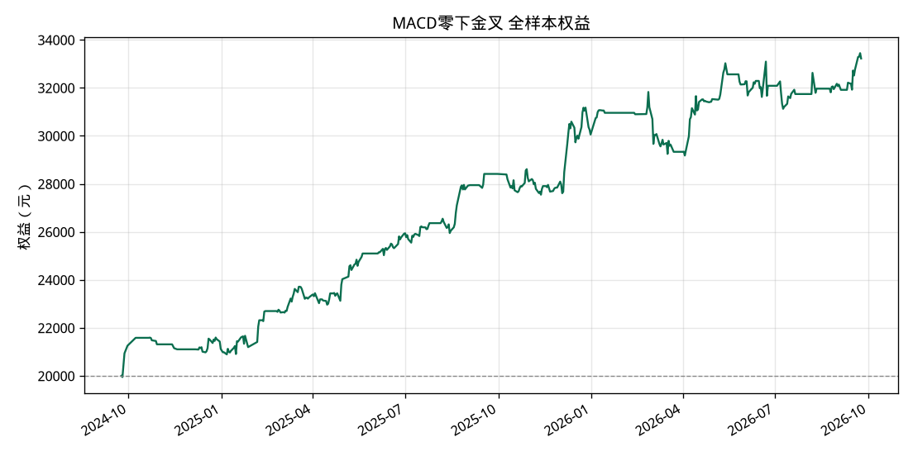

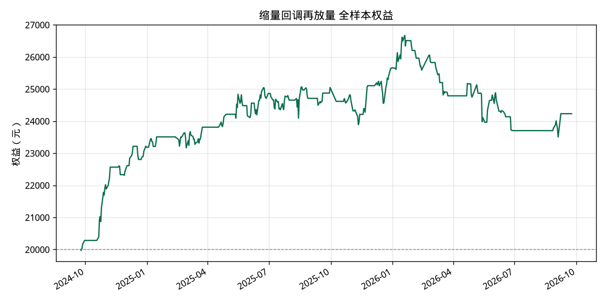

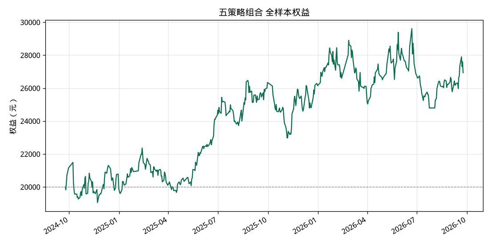

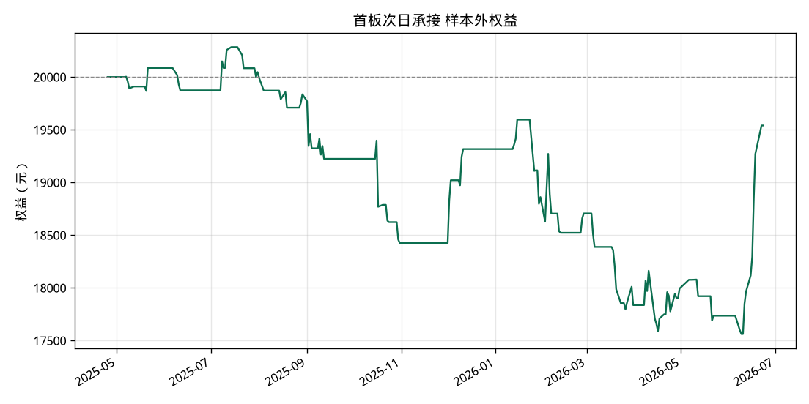

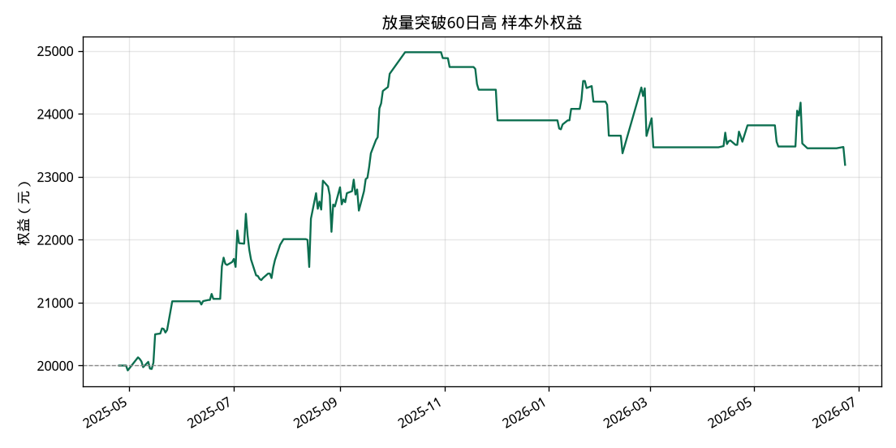

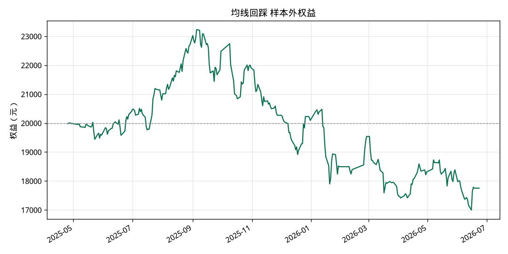

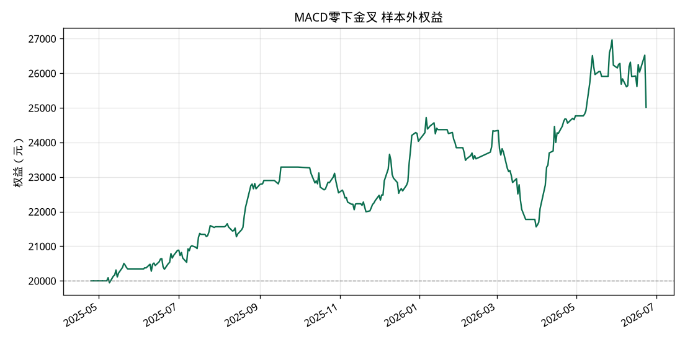

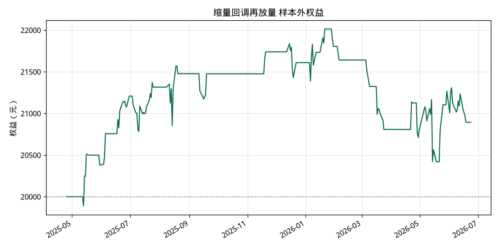

## 最近成交（全样本组合）

| 代码 | 策略 | 买入日 | 卖出日 | 股数 | 买入价 | 卖出价 | 盈亏 | 原因 |
| --- | --- | --- | --- | ---: | ---: | ---: | ---: | --- |
| 002241 | MACD零下金叉 | 2026-08-25 | 2026-09-04 | 200 | 23.51 | 23.39 | -36.44 | time |
| 600330 | 缩量回调再放量 | 2026-09-04 | 2026-09-08 | 200 | 27.48 | 29.86 | 462.90 | take_profit |
| 600186 | 均线回踩 | 2026-09-08 | 2026-09-10 | 500 | 12.41 | 11.75 | -343.06 | stop |
| 002241 | 均线回踩 | 2026-09-09 | 2026-09-10 | 200 | 23.55 | 22.59 | -204.36 | stop |
| 600036 | 均线回踩 | 2026-09-02 | 2026-09-14 | 100 | 40.94 | 41.79 | 72.83 | time |
| 300207 | MACD零下金叉 | 2026-09-11 | 2026-09-16 | 300 | 17.67 | 19.06 | 404.03 | take_profit |
| 002396 | 均线回踩 | 2026-09-16 | 2026-09-17 | 100 | 35.32 | 38.11 | 267.01 | take_profit |
| 600150 | 放量突破60日高 | 2026-09-08 | 2026-09-18 | 100 | 38.60 | 39.43 | 70.95 | time |
| 601579 | 放量突破60日高 | 2026-09-18 | 2026-09-21 | 200 | 30.14 | 33.47 | 652.52 | take_profit |
| 601398 | 均线回踩 | 2026-09-10 | 2026-09-22 | 800 | 8.03 | 8.11 | 50.64 | time |
| 601872 | 首板次日承接 | 2026-09-21 | 2026-09-22 | 300 | 22.16 | 21.25 | -286.32 | stop |
| 000725 | MACD零下金叉 | 2026-09-18 | 2026-09-23 | 1100 | 5.79 | 6.24 | 481.44 | take_profit |

## 未成交统计（组合）

- 持仓数量已满: 898
- 高开超出买入区间: 78
- 低开超出买入区间: 36
- 涨停无法买入: 9

## 数据与局限

- 主行情源为腾讯日线（不复权，含除权信息）；单只失败时改用新浪日线。2026-09-27 探测东财 push2his 得到空响应，本次运行没有访问东财。通达信公开行情端口按 2026-09 的公开记录已不可用，未接入。
- 股票池按运行当日的成交额筛选，已退市股票不会出现，存在幸存者偏差。
- 没有逐笔行情，涨停开板又封死的日内过程用日线近似，真实成交会更差一些。
- 当前名称不含 ST 不代表历史上从未被 ST。
